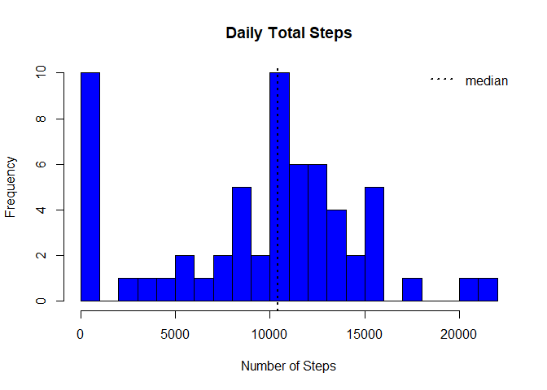

## **Loading and preprocessing the data**

### Unzip the zip file to obtain the data


```r
unzip("repdata_data_activity.zip",exdir = "proj_data")
```

### Read the .csv file into a dataframe

```r
activity_df <- read.csv('proj_data/activity.csv')
```


## **What is mean total number of steps taken per day?**

### Calculate the total number of steps taken per day

```r
library(ggplot2)
steps <- data.frame(tapply(activity_df$steps,activity_df$date,sum,na.rm=TRUE))

steps$date <- rownames(steps)
rownames(steps) <- NULL

colnames(steps) <- c('Total_Steps','Date')
```

### Make a histogram of the total number of steps taken each day

```r
hist(steps$Total_Steps,col="blue", breaks=20, main="Daily Total Steps",
     xlab="Number of Steps")
abline(v=median(steps$Total_Steps), lty=3, lwd=2, col="black")
legend(legend="median", "topright", lty=3, lwd=2, bty = "n")
```

<!-- -->


### Calculate and report the mean and median of the total number of steps taken per day

```r
mean_daily_steps <- mean(steps$Total_Steps,na.rm=TRUE)
median_daily_steps <- median(steps$Total_Steps,na.rm=TRUE)
```
The average total number of steps taken per day is 9354.2295082 steps while the median is seen at 10395 steps.


## **What is the average daily activity pattern?**

### Make a time series plot (i.e. \color{red}{\verb|type = "l"|}type = "l") of the 5-minute interval (x-axis) and the average number of steps taken, averaged across all days (y-axis)


```r
library(dplyr)
```

```
## 
## Attaching package: 'dplyr'
```

```
## The following objects are masked from 'package:stats':
## 
##     filter, lag
```

```
## The following objects are masked from 'package:base':
## 
##     intersect, setdiff, setequal, union
```

```r
daily_average <- activity_df %>% group_by(interval) %>% summarise(average=mean(steps,na.rm=TRUE))
plot(x = 1:nrow(daily_average),y = daily_average$average,type = "l",
     col = "red", xaxt = "n",xlab="Intervals", 
     ylab = "Average for given interval across all days")
axis(1,labels=daily_average$interval[seq(1,288,12)],
     at = seq_along(daily_average$interval)[seq(1,288,12)])
```

<!-- -->

### Which 5-minute interval, on average across all the days in the dataset, contains the maximum number of steps?


```r
max_steps_interval <- filter(daily_average, average==max(average))
```

The 5-minute interval that contains the maximum number of steps of 206.1698113 is interval 835.

## **Imputing missing values**


### Calculate and report the total number of missing values in the dataset (i.e. the total number of rows with \color{red}{\verb|NA|}NAs)


```r
num_of_na <- sum(is.na(activity_df$steps))
```

The total number of rows with missing values (encoded as NA) is 2304.

### Devise a strategy for filling in all of the missing values in the dataset.

To fill in all the missing values in the dataset, the average number of steps per 5 minutes interval will be used.

### Create a new dataset that is equal to the original dataset but with the missing data filled in.


```r
remove_NA <- numeric(nrow(activity_df))

for (i in 1:nrow(activity_df))
{
        if (is.na(activity_df[i,"steps"])==TRUE){
          remove_NA[i]<-filter(daily_average,interval==activity_df[i,"interval"]) %>% 
            select(average)
          } 
        else{
          remove_NA[i]<-activity_df[i,"steps"]
          }
                    
}

new_activity_df<-mutate(activity_df,steps_new=remove_NA)
head(new_activity_df)
```

```
##   steps       date interval steps_new
## 1    NA 2012-10-01        0  1.716981
## 2    NA 2012-10-01        5 0.3396226
## 3    NA 2012-10-01       10 0.1320755
## 4    NA 2012-10-01       15 0.1509434
## 5    NA 2012-10-01       20 0.0754717
## 6    NA 2012-10-01       25   2.09434
```

### Make a histogram of the total number of steps taken each day and Calculate and report the mean and median total number of steps taken per day. 

#### Histogram


```r
library(ggplot2)
new_steps <- data.frame(tapply(as.numeric(new_activity_df$steps_new),new_activity_df$date,sum,na.rm=TRUE))

new_steps$date <- rownames(new_steps)
rownames(new_steps) <- NULL

colnames(new_steps) <- c('Total_Steps','Date')

hist(new_steps$Total_Steps,col="blue", breaks=20, main="Daily Total Steps",
     xlab="Number of Steps")
abline(v=median(new_steps$Total_Steps), lty=3, lwd=2, col="black")
legend(legend="median", "topright", lty=3, lwd=2, bty = "n")
```

<!-- -->

#### Mean and Median

```r
new_mean_daily_steps <- mean(new_steps$Total_Steps,na.rm=TRUE)
new_median_daily_steps <- median(new_steps$Total_Steps,na.rm=TRUE)
```
The average total number of steps taken per day is 1.0766189\times 10^{4} steps while the median is seen at 1.0766189\times 10^{4} steps.

#### Conclusion

Imputing the average values to the NA values before increased the mean and median of the dataset.


## **Are there differences in activity patterns between weekdays and weekends?**

### Create a new factor variable in the dataset with two levels – “weekday” and “weekend” indicating whether a given date is a weekday or weekend day.


```r
library(lubridate)
```

```
## 
## Attaching package: 'lubridate'
```

```
## The following objects are masked from 'package:base':
## 
##     date, intersect, setdiff, union
```

```r
type_of_day <- function(date){
        if(wday(date) %in% c(1,7)) 
          result <- "weekend"
        else
          result <- "weekday"
        result
}
new_activity_df <- mutate(new_activity_df,date=ymd(date)) %>% mutate(day_type=sapply(date, type_of_day))
```

### Make a panel plot containing a time series plot (i.e. \color{red}{\verb|type = "l"|}type = "l") of the 5-minute interval (x-axis) and the average number of steps taken, averaged across all weekday days or weekend days (y-axis).


```r
library(ggplot2)
panel_data <- new_activity_df %>% mutate(day_type=factor(day_type,levels=c("weekend","weekday")),steps_new=as.numeric(steps_new)) %>% group_by(interval,day_type) %>% summarise(average=mean(steps_new))
```

```
## `summarise()` has grouped output by 'interval'. You can override using the `.groups` argument.
```

```r
qplot(interval,average,data=panel_data,geom="line",facets=day_type~.)
```

<!-- -->
